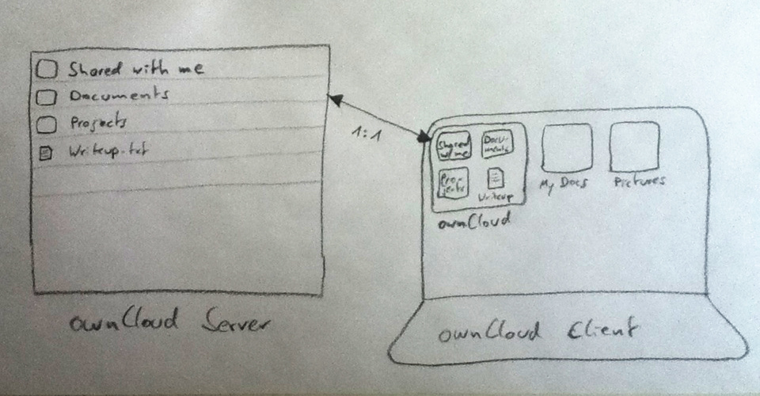
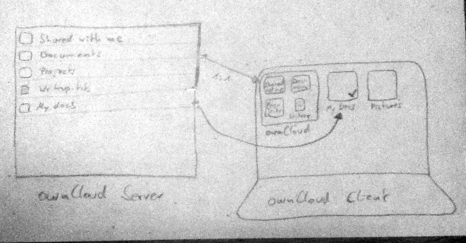
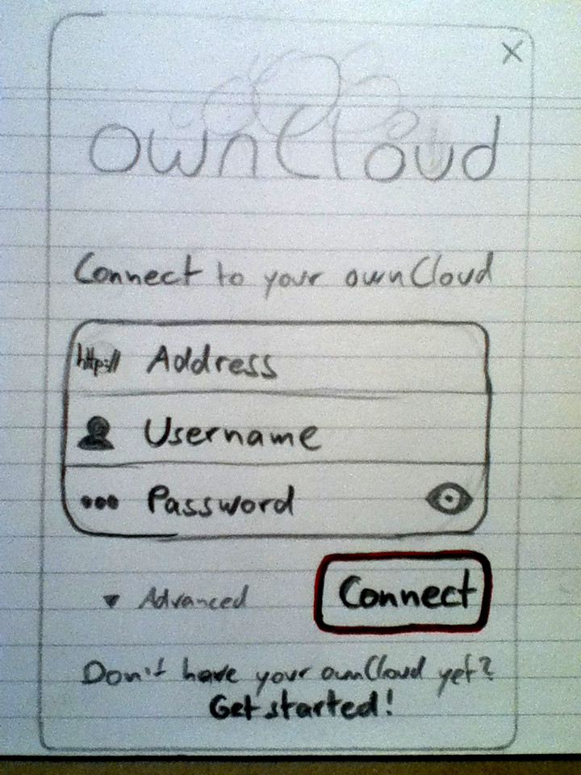
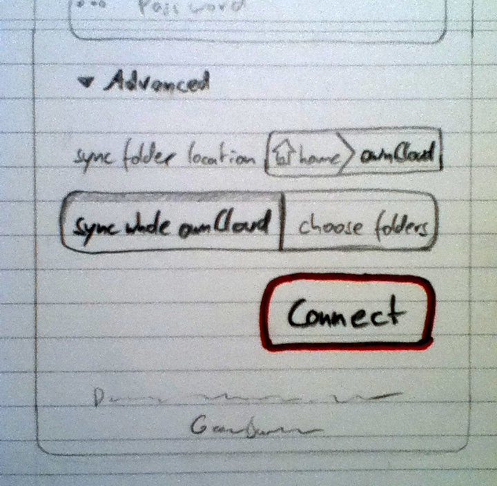
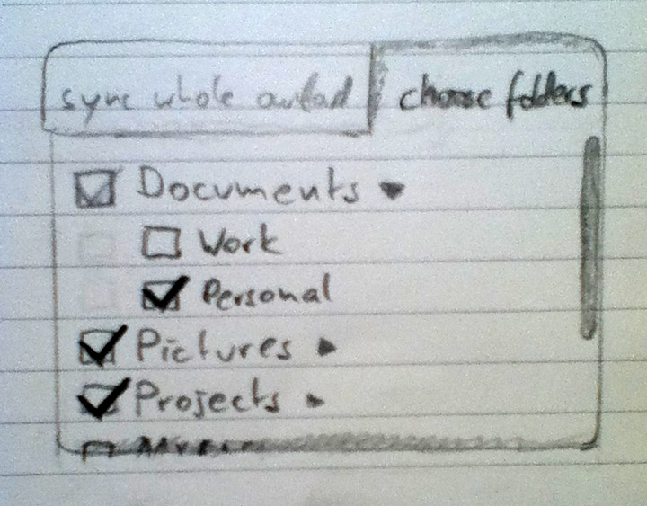
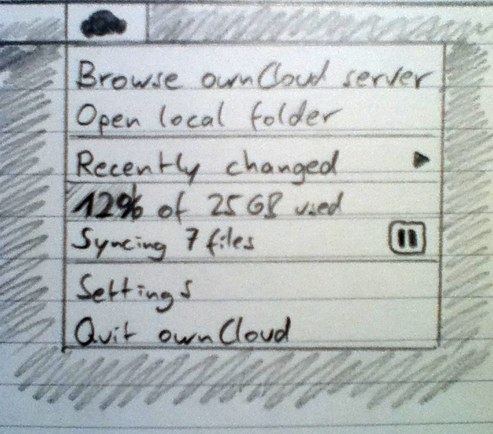
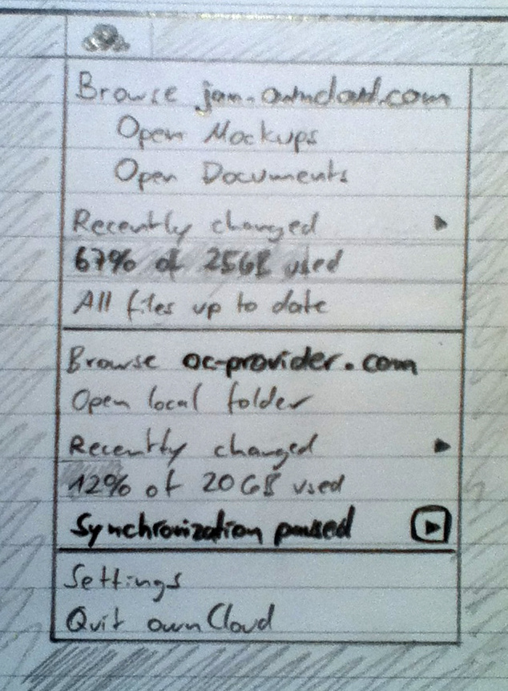
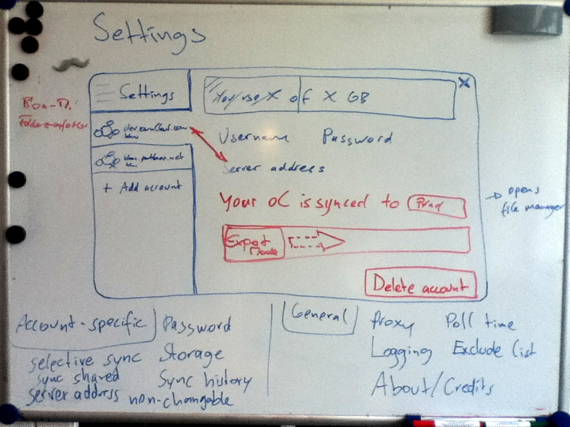
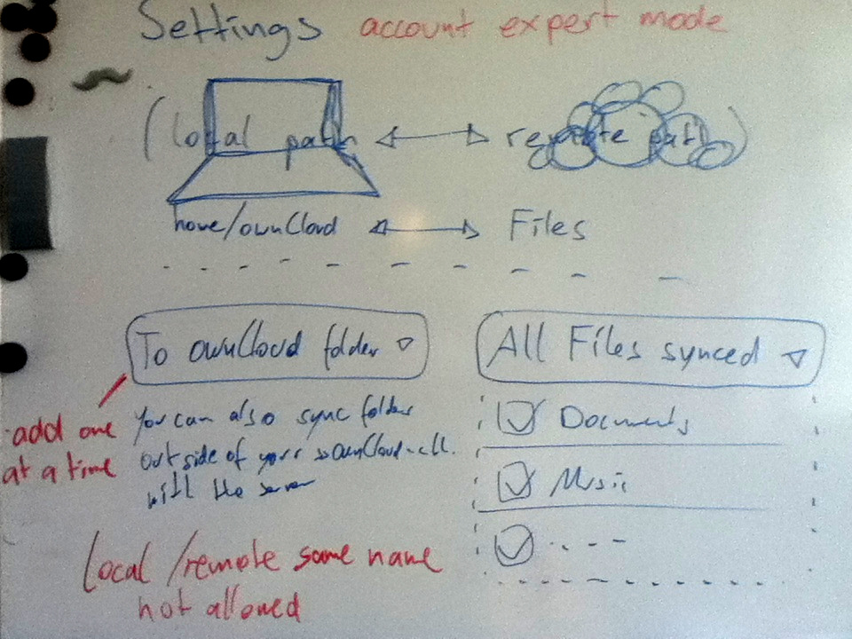

# ownCloud desktop client

## General thoughts

* We need to optimize for the standard use case: just syncing everything inside the user account on the ownCloud server with an »ownCloud« folder in the user’s home folder on the device.
  * »clientsync« subfolder needs to be phased out
  * »sync target« choice also needs to be removed because it’s too unspecific to ownCloud – of course I want to sync with my ownCloud when I installed the client ;)
* It should be possible to do selective sync, that is only syncing down specific folders from the server, useful for small machines or bad connections. Not granular down to the file level though to keep it simple.
* It should also be possible to sync folders from anywhere on your computer. Either by just right-clicking on the folder and choosing »Sync with ownCloud« or by adding it manually in the settings.
* Small files should be synced first because that’s fast and most likely text with lots of useful content.
* »mirall« repo name should be changed to »desktop« to clear up confusion when wanting to report issues, contribute, etc.
* Lots of these points are also valid for the iOS and Android clients

## Sync mechanism
First off we need to define how syncing works, with selective sync and different clients.

The default setup (advanced options ignored) will sync all files and folders of the ownCloud Files app into an »ownCloud« folder in your home directory. For a regular setup, the contents of the local »ownCloud« folder will be the same as what you see when you look into the Files app of the web interface. (For the advanced options see below and under Setup.)

(The quality on the 2 following diagrams is bad, but suffices to get the point across.)
Now when you want to selectively sync any folder from your desktop, it should show in the root of the Files app in the web interface, with the same name it locally has on the device it comes from. Ideally the client should know that this device already has the folder somewhere and _not_ duplicate it by syncing it down to the ownCloud folder.

When you then connect a second device and choose the default setup with syncing everything, that device will receive all contents of the ownCloud Files root in the local »ownCloud« folder. Including the selectively synced folders and files from other devices.

For existing users of the client simply do not migrate anything. If you just update as existing user, everything works as before with the clientsync folder. We have to inform people that if they want to switch to the new »easy way« they will have to uninstall and reinstall.

## Setup

The setup dialog which is the first thing people see after installing the client. Note this is only the first-run experience, and differs from the settings dialog.

The most important elements are the inputs for address, username, password and the connect button. These are the only things needed in the simplest use case:
 * **Address**, with a small cloud icon
   * Should be focused, so people can directly start typing.
   * Connection should be checked with SSL automatically, while doing so overlay the cloud icon with a loading spinner.
     * If the connection is successful, the cloud icon should get a small lock icon attached on the bottom right and a green background, as known from browser address bars. Hovering the icon should reveal a tooltip saying: »Secure connection established«
     * If the SSL connection fails, http should be tried
     * If http is successful, the cloud icon should get a small exclamation triangle attached on the bottom right, a yellow background and on hover reveal a tooltip saying: »Connection is insecure«
       * **What should happen then? Retry, or tip how to fix it?**
     * If the connection fails completely, the cloud icon should get a small x attached on the bottom right, a yellow background and on hover reveal a tooltip saying: »Connection failed. Retrying …« – automatically retrying when the tooltip is hovered or clicked.
   * Base address should be tested if people put in a WebDAV address
   * For whitelabeling, the address field should be possible to hide and have the address hard-coded.
   * Maybe there should be a hardcoded list of known providers in the client which can be used to automatically correct errors in the address (only if the connection doesn’t work)
 * **Username**, with a small user icon
 * **Password**, with a small dot-dot-dot icon
   * A »show password« toggle (closed/open eye) on the right of the field should enable people to check their password after they put it in. By default set to off of course.
   * Pressing enter in this field should lead to the connection being initiated, but only if the address was checked and correctly resolved.
(In the future it might be even simpler when every ownCloud server could use OAuth – then you would just need to put in the address, be redirected to your ownCloud server and the client receives a token.)
 * Not in the sketch: a **»sync files shared with me«** setting, deselected by default. This should sync the »Shared« folder down into the »ownCloud folder«.

Additionally there is an »Advanced« section, containing advanced settings which are better set before starting sync:
 * Sync folder location
   * This defaults to »ownCloud« in the home folder
   * Clicking on it should open the native folder chooser dialog where a different directory can be chosen and a differently named folder.
 * Selective sync
   * This enables people to only sync specific folders from their ownCloud to the client (it’s exactly what Dropbox also does)
   * The default is »Sync whole ownCloud«, and you can switch to »Choose folders«
   * »Choose folders« will display the folders from the ownCloud, by default all of them checked, with the possibility to uncheck each.
   * To be able to quickly judge what’s probably too big or irrelevant to sync, the file/folder size should be shown there also.
If people want to cancel the client, there is a small unobtrusive x in the top right corner (or top left for Mac OS).

* Below the »Finish setup« button maybe a short recap of what will happen, for information: This will sync your ownCloud server to a local »ownCloud« folder.
* After connection, there could be a short tour of features.
* The ownCloud folder could automatically be openend in the file manager.

## Indicator menu

* Browse ownCloud server
  * Can have multiple servers, but will only show 2 completely in the indicator because otherwise it gets too long. Any additional ones should just have one line each, having a menu expand to the side.
* Open local folder
  * If selective sync on the desktop is used, this can also have multiple entries. Clicking any of those should open the relevant folder in the file manager.
* Recently changed
  * A list of, say, 5 recently changed files from the server.
  * Last entry of the list could be a link to a future »status updates« page.
* X% of XGB used
  * If possible, this could have a bar indicator as a background.
  * For branded clients there could be a »get more« link on the right of this to a pricing page of the provider.
* Sync state, each one with a button to the right
  * All files up to date (force sync button, circular arrows icon)
  * Syncing X files (x:xx remaining) (pause sync, pause icon)
  * Synchronization paused (resume sync, play icon) set in bold
  * Offline (reconnect button, circular arrows icon) set in bold
  * Connection error (reconnect button, circular arrows icon)
    * If a retry doesn’t work, replace the reconnect button with a link to the account in settings
* Settings
* Quit ownCloud

* If there’s more than one account, it’s probably better to just have one line per additional account instead of cluttering up the indicator menu.

## Settings

All settings, general as well as account-specific ones, should be in one window with tabbed navigation. The general settings will be the first, most prominent tab. The accounts will be below that, with the last entry in the list enabling people to add a new account.

General settings can include:
* show desktop notifications (default on)
* start ownCloud on system startup (default on)
* proxy
* poll time
* bandwidth limitation
* about / credits / help / issues (link tracker)

Account-specific are things such as
* ownCloud connection status (also shown in the small icon in the account list)
* address, username, password
* disconnect

Then there should be an advanced account mode, which enables people to selectively sync local folders. As this has many specifics and edge-cases, sketches will only come so far and we need to design and refine this as we go along.

Basically it would be a list of connections, local folder on the left and remote folder on the right. From there you can add, update and remove selectively synced folders.

## File manager integration
* Sync state badges for files and folders, using the same icons Achim made for the tray (maybe just the specific state icon without the ownCloud icon part, for simplicity.)
* Right-click menu on files inside a synced folder should have an »ownCloud« entry, containing:
  * Browse online (open ownCloud server with Files app at that location, go into preview mode if it’s a file)
  * Share link (public sharing)
  * Share file/folder (private sharing)
* Right-click menu on any folder outside an already synced folder should contain an entry »Sync with ownCloud«, which leads to the settings.

## Discovery & Installation
Improving the client also includes improving how people discover, download and install it. Thoughts on the different ways people might do this:

 * Visit owncloud.org/com, look for client
   * Should probably show directly on frontpage, ideally detect your operating system and focus on the relevant download.
 * googling for owncloud dektop/client/windows/mac/linux, leads to owncloud.org/sync-clients or owncloud.com/download
   * both of these pages should detect the client they are accessed from and prioritize the download links accordingly
 * Is the current version installable from the Mac Appstore or Ubuntu Software Center? Is it feasible to keep it updated in there?
 * Is it possible to automatically open the app (connect dialog) after installation?

